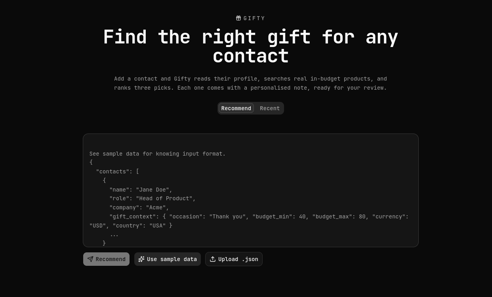

# Gifty

<p align="center">
  
</p>

<p align="center">
  
  
  
  
  
  
  <br />
  
  
  
  
  
  
  <br />
  
  
  
</p>

Gifty turns enriched, LinkedIn-style contact data into the top 3 personalised, real
purchasable gift recommendations per contact. Each pick comes with reasoning, a personalised
note, a confidence score, a risk level, and a human-review step.

Gifts are never invented. A web search engine (Tavily) supplies real product URLs, the
pipeline checks they are live and relevant, and the model only reasons over the validated
candidates.

This repository is a monorepo with two parts:

| Part | Stack | README |
|------|-------|--------|
| **backend** | FastAPI, LangGraph, Pydantic, SQLite | [backend/README.md](backend/README.md) |
| **frontend** | Vite, React, TypeScript, Tailwind, shadcn/ui | [frontend/README.md](frontend/README.md) |

For the design rationale (what was chosen, and how it differs from the common approach), see
[DECISIONS.md](DECISIONS.md). For how I measure recommendation quality, see [EVAL.md](EVAL.md).

## Quickstart

Needs [`uv`](https://docs.astral.sh/uv/) (Python) and [`bun`](https://bun.sh/) (frontend).

```bash
./dev.sh setup # install backend + frontend deps, create backend/.env
```

Add your API keys to `backend/.env`: an LLM provider key (`ANTHROPIC_API_KEY` or
`GEMINI_API_KEY`) plus `TAVILY_API_KEY` for search. Then:

```bash
./dev.sh # run backend (:8000) and frontend (:5173) together
```

Open `http://localhost:5173`, load the sample data, and run it. Ctrl-C stops both servers.

`./dev.sh` also accepts `backend` or `frontend` to run only one side.

## How it works

```
POST /runs  (N contacts)
  |
  |- Stage 1: batched analyze (fast model)        signals + search queries per contact
  |             scrub sensitive signals            deterministic guard, no LLM
  |
  |- Stage 2: per-contact graph (concurrent, bounded)
                search -> validate -> recommend(reasoning model)
                            retry once if fewer than 3 grounded products survive
```

Results are persisted as plain rows. Review (approve, reject, regenerate) happens
through separate REST endpoints, so it stays durable across restarts. The frontend can also
stream a run live over Server-Sent Events as a two-level roadmap (phase + sub-step) of progress,
and **View more** on any card opens a detail page with the full gift fields, trace, and per-model
usage.

## Layout

```
backend/    FastAPI app, LangGraph pipeline, provider-agnostic LLM client, SQLite store
frontend/   React review UI: input, live progress, per-contact review, detail route
dev.sh      one-command setup and run for both sides
DECISIONS.md design decisions and trade-offs
EVAL.md     how recommendation quality is measured
```

## Future improvements

- **More providers.** The LLM client is a small factory behind one env toggle, so adding a
  provider (OpenAI, a local model) is a new branch in `llm/client.py` and two model names in
  config, with nothing else touched.
- **Speed.** The UI path is sequential by choice to stay under free-tier limits. With paid
  quota it can fan out contacts concurrently (the `POST /runs` path already does), and the
  search and validate steps can be parallelised further.
- **Real eval pipeline.** Turn the plan in [EVAL.md](EVAL.md) into a runnable suite: a fixed
  contact set, the automatic checks as a gate, and a scored rubric for the judgement metrics so
  quality regressions are caught automatically.

## License

[MIT](LICENSE).
